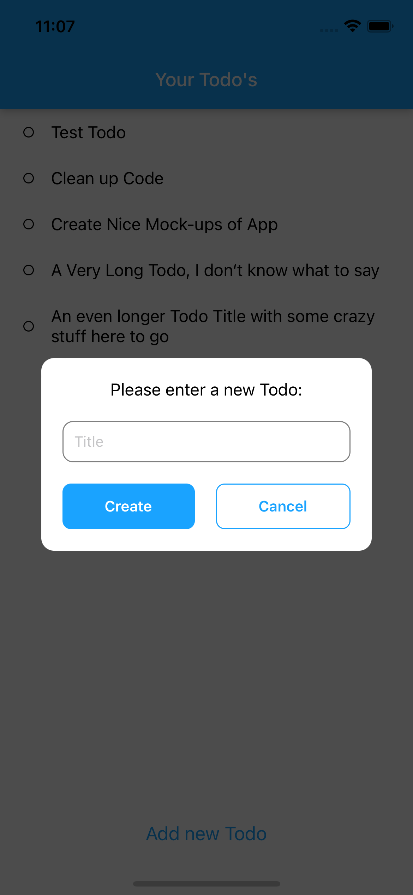
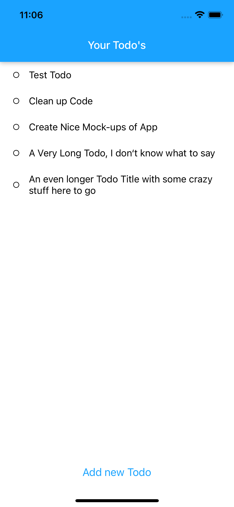
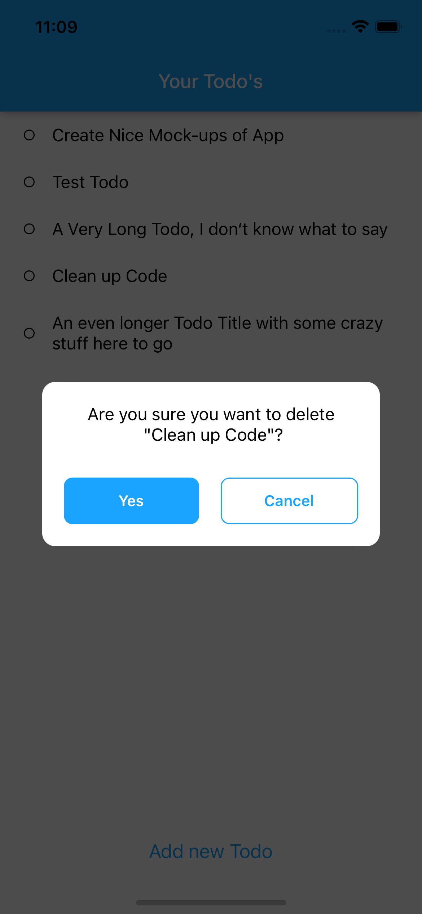

<a name="readme-top"></a>

<!-- PROJECT HEADER -->
<br />
<div align="center">
  <a href="https://github.com/Cyber-Griffo/TodoAppRNFb">
    
  </a>
  <div align="center">
    <a href="https://github.com/Cyber-Griffo/TodoAppRNFb/network/members">
      
    </a>
    <a href="https://github.com/Cyber-Griffo/TodoAppRNFb/stargazers">
      
    </a>
    <a href="https://github.com/Cyber-Griffo/TodoAppRNFb/issues">
      
    </a>
    <a href="https://github.com/Cyber-Griffo/TodoAppRNFb/blob/master/LICENSE.md">
      
    </a>
  </div>

<h3 align="center">TodoApp with React-Native and Firebase</h3>

  <p align="center">
    This project is a simple implementation of a ToDo app using React-Native and Firebase
  </p>
</div>


<!-- TABLE OF CONTENTS -->
<details>
  <summary>Table of Contents</summary>
  <ol>
    <li>
      <a href="#about-the-project">About The Project</a>
      <ul>
        <li><a href="#built-with">Built With</a></li>
      </ul>
    </li>
    <li>
      <a href="#getting-started">Getting Started</a>
      <ul>
        <li><a href="#prerequisites">Prerequisites</a></li>
        <li><a href="#installation">Installation</a></li>
      </ul>
    </li>
    <li><a href="#license">License</a></li>
    <li><a href="#contact">Contact</a></li>
    <li><a href="#acknowledgments">Acknowledgments</a></li>
  </ol>
</details>


<!-- ABOUT THE PROJECT -->
## About The Project

<div align="center">
  
  
  
</div>

<p align="right">(<a href="#readme-top">back to top</a>)</p>


### Built With

* [![React-Native][React-Native-shield]][React-Native-url]
* [![Firebase][Firebase-shield]][Firebase-url]
* [![Typescript][Typescript-shield]][Typescript-url]

<p align="right">(<a href="#readme-top">back to top</a>)</p>


<!-- GETTING STARTED -->
## Getting Started

To get a local copy up and running follow these simple example steps.

<br/>

### Prerequisites

Make sure you have set up your [React-Native-Enviornment](https://reactnative.dev/docs/environment-setup) properly.

<br/>

### Installation


Clone the repo
```
git clone https://github.com/Cyber-Griffo/TodoAppRNFb.git
```

<br/>

Install NPM packages either with:
```
yarn install
```

or:

```
npm install
```

Note: On MacOs you have to run `cd ios && pod install` in order to install pod dependencies.

<br/>

Start the emulator:

```
yarn run adroid
```
```
yarn run ios
```

<p align="right">(<a href="#readme-top">back to top</a>)</p>

<!-- LICENSE -->
## License

Distributed under the MIT License. See `LICENSE.txt` for more information.

<p align="right">(<a href="#readme-top">back to top</a>)</p>


<!-- CONTACT -->
## Contact

📧 Christoph Gerling - christoph.gerling1603@gmail.com

📋 Project Link: [https://github.com/Cyber-Griffo/TodoAppRNFb](https://github.com/Cyber-Griffo/TodoAppRNFb)

[![LinkedIn][linkedin-shield]][linkedin-url]

<p align="right">(<a href="#readme-top">back to top</a>)</p>


<!-- ACKNOWLEDGMENTS -->
## Acknowledgments

* []()
* []()
* []()

<p align="right">(<a href="#readme-top">back to top</a>)</p>


<!-- MARKDOWN LINKS -->
[linkedin-shield]: https://img.shields.io/badge/LinkedIn-blue?style=for-the-badge&logo=linkedin&logoColor=white
[linkedin-url]: https://linkedin.com/in/christoph-gerling-45217023b

[React-Native-shield]: https://img.shields.io/badge/React%20Native-20232A?style=for-the-badge&logo=react&logoColor=61DAFB
[React-Native-url]: https://reactnative.dev/
[Firebase-shield]: https://img.shields.io/badge/Firebase-20232A?style=for-the-badge&logo=firebase
[Firebase-url]: https://firebase.google.com/
[Typescript-shield]: https://img.shields.io/badge/Typescript-20232A?style=for-the-badge&logo=typescript&logoColor=61DAFB
[Typescript-url]: https://www.typescriptlang.org/
